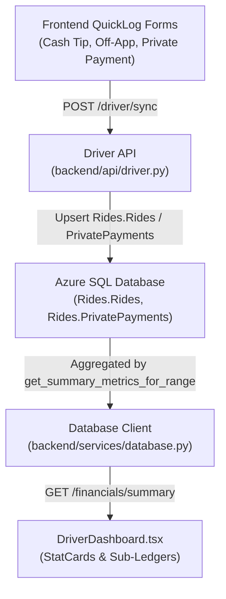

# Driver Financials & Ledger Reconciliation Runbook

This skill establishes the architecture, invariants, and verification procedures for revenue operations and financial tracking across SummitOS. It prevents cross-contamination between rideshare earnings, cash gratuities, and private bookings across the Python Azure Functions backend and Next.js React frontends.

---

## 1. System Architecture & Dual-Stack Topology

Financial metrics in SummitOS are computed through a decoupled, multi-tier pipeline:



### Critical File Locations:
- **Backend API Routes:** [`backend/api/driver.py`](file:///c:/Users/PeterTeehan/OneDrive%20-%20COS%20Tesla%20LLC/COS%20Tesla%20-%20Website/Summit-OS-Web-master/backend/api/driver.py) (`/financials/summary`, `/driver/sync`)
- **Backend Database Services:** [`backend/services/database.py`](file:///c:/Users/PeterTeehan/OneDrive%20-%20COS%20Tesla%20LLC/COS%20Tesla%20-%20Website/Summit-OS-Web-master/backend/services/database.py)
- **Frontend Dashboard (Workspace):** [`frontend/apps/dashboard/src/components/DriverDashboard.tsx`](file:///c:/Users/PeterTeehan/OneDrive%20-%20COS%20Tesla%20LLC/COS%20Tesla%20-%20Website/Summit-OS-Web-master/frontend/apps/dashboard/src/components/DriverDashboard.tsx)
- **Frontend Dashboard (Root Mirror):** [`frontend/src/components/DriverDashboard.tsx`](file:///c:/Users/PeterTeehan/OneDrive%20-%20COS%20Tesla%20LLC/COS%20Tesla%20-%20Website/Summit-OS-Web-master/frontend/src/components/DriverDashboard.tsx)
- **Automated Tests:** [`backend/tests/test_cash_tips_financials.py`](file:///c:/Users/PeterTeehan/OneDrive%20-%20COS%20Tesla%20LLC/COS%20Tesla%20-%20Website/Summit-OS-Web-master/backend/tests/test_cash_tips_financials.py)

---

## 2. Revenue Categorization & Decoupling Invariants

To avoid income pollution, every operational transaction must adhere to strict typing rules:

| Category | `TripType` | `Classification` | `RideID` Prefix | `fare` | `tip` | `driver_earnings` | Target StatCard |
| :--- | :--- | :--- | :--- | :--- | :--- | :--- | :--- |
| **Uber On-App** | `Uber` | `Uber_Matched` / OCR | (OCR or external) | Rider Cost | In-App Tip | Driver Net Cut | **Uber Rideshare** (`uber_on_app`) |
| **Cash Tip / Gratuity** | `Uber_OffApp` | `Cash Tip` | `M-TIP-*` | `0.0` | Tip Amt | Tip Amt | **Cash Tips** (`cash_tips`) |
| **Uber Off-App Ride** | `Uber_OffApp` | `Uber_OffApp` | `M-OFFAPP-*` | Fare Amt | `0.0` | Fare Amt | **Cash Tips** (`cash_tips`) |
| **Private Booking** | `Private` | `Manual_Entry` / `Private` | `M-PRIV-*` / `INV-*` | Agreed Fare | Extra Tip | Total Paid | **Private Income** (`private_income`) |
| **Direct Private Payment** | N/A | Logged to `PrivatePayments` | N/A | Payment Amt | `0.0` | Net | **Private Income** (`private_income`) |

> [!CAUTION]
> **Never dispatch a Cash Tip with `type: "Private"`.**
> A tip dispatched with `type: "Private"` causes the backend SQL query `WHERE TripType = 'Private'` to aggregate the tip into `private_booking_sum`, artificially inflating Private Income while leaving the Cash Tips StatCard at \$0.00.

---

## 3. Database Aggregation & Operational Window Standards

SummitOS operates on an operational day starting at **04:00 MST** and ending at **04:00 MST the following day**:
```sql
WHERE Timestamp_Start >= DATEADD(hour, 4, CAST(? AS DATETIME2))
  AND Timestamp_Start < DATEADD(hour, 28, CAST(? AS DATETIME2))
```

### Authoritative Query Definitions in `database.py`

#### 1. Cash Tips & Off-App Gratuities (Query 1b):
```sql
SELECT SUM(CASE 
    WHEN Driver_Earnings IS NOT NULL AND Driver_Earnings > 0 THEN Driver_Earnings 
    ELSE COALESCE(Fare, 0) + COALESCE(Tip, 0) 
END)
FROM Rides.Rides
WHERE Timestamp_Start >= ? AND Timestamp_Start < ?
  AND (TripType = 'Uber_OffApp' OR Classification LIKE '%Tip%' OR RideID LIKE 'M-TIP-%' OR RideID LIKE 'M-OFFAPP-%')
  AND DeletedAt IS NULL
  AND (IsTest IS NULL OR IsTest = 0)
```

#### 2. Paid Private Bookings (Query 2 - Explicitly Decoupled from Tips):
```sql
SELECT SUM(Fare + Tip)
FROM Rides.Rides
WHERE Timestamp_Start >= ? AND Timestamp_Start < ?
  AND TripType = 'Private'
  AND RideID NOT LIKE 'M-TIP-%'
  AND RideID NOT LIKE 'M-OFFAPP-%'
  AND (Classification IS NULL OR (Classification NOT LIKE '%Tip%' AND Classification != 'Uber_OffApp'))
  AND PaymentStatus = 'Paid'
  AND DeletedAt IS NULL
  AND (IsTest IS NULL OR IsTest = 0)
```

#### 3. Date Window Filter in `get_trips_by_date`:
Must preserve \$0-fare gratuity rows:
```sql
AND (
  Fare > 0
  OR Tip > 0
  OR Driver_Earnings > 0
  OR Classification = 'Manual_Entry'
  OR Classification = 'Uber_Matched'
  OR Classification LIKE '%Tip%'
  OR Classification = 'Uber_OffApp'
  OR RideID LIKE 'M-TIP-%'
  OR RideID LIKE 'M-OFFAPP-%'
  OR (...)
)
```

---

## 4. API Contract (`/financials/summary`)

The public endpoint must return all components to satisfy the TypeScript interface `FinancialsSummaryResponse`:

```json
{
  "success": true,
  "date": "2026-09-08",
  "gross_earnings": 385.50,
  "uber_earnings": 235.50,
  "uber_on_app": 205.50,
  "cash_tips": 30.00,
  "uber_tips": 45.00,
  "private_income": 150.00,
  "opex_expenses": 42.10,
  "capex_expenses": 17.50,
  "expenses": 59.60,
  "net_profit": 343.40
}
```

---

## 5. Frontend Symmetrical Maintenance Protocol

The SummitOS frontend codebase maintains two tracked copies of the driver dashboard:
1. `frontend/apps/dashboard/src/components/DriverDashboard.tsx`
2. `frontend/src/components/DriverDashboard.tsx`

### Mandatory Rule:
Whenever modifying forms, hooks, or memos in `DriverDashboard.tsx`, **both files must be updated identically**.

### Client-Side Sub-Ledger Memos:
- **Private Bookings (`privateBookings`):** Must strictly filter out `!t.id.startsWith('M-TIP-') && !t.id.startsWith('M-OFFAPP-') && t.classification !== 'Cash Tip' && !t.classification?.includes('Tip') && t.classification !== 'Uber_OffApp'`.
- **Cash Tips (`cashTips`):** Must match `t.type === 'Uber_OffApp' || t.classification === 'Cash Tip' || t.classification?.includes('Tip') || t.id.startsWith('M-OFFAPP-') || t.id.startsWith('M-TIP-')`.
- **Display Fallback:** Render values with `t.driver_earnings || (t.fare > 0 ? t.fare : t.tip) || 0` to accurately support \$0-fare gratuity rows.

---

## 6. Verification Checklist

Before pushing changes affecting financial metrics:
1. [ ] **Automated Tests:** Run `python -m pytest backend/tests/test_cash_tips_financials.py -v`.
2. [ ] **Regression Suite:** Run `python -m pytest backend/tests/test_operational_window.py -v`.
3. [ ] **File Symmetry:** Run `git diff frontend/apps/dashboard/src/components/DriverDashboard.tsx frontend/src/components/DriverDashboard.tsx` to confirm 0 differences.
4. [ ] **Payload Check:** Confirm `/financials/summary` response contains non-null `cash_tips` and `uber_on_app`.
