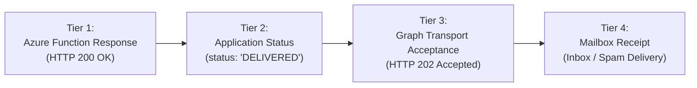

# External Email Dispatch & Deliverability Triage Runbook

This skill provides an authoritative runbook for resolving external email deliverability failures, investigating Microsoft Graph API transport issues, and accurately classifying audit evidence for automated reports (e.g., SummitOS EOD partner reports).

---

## 1. Audit Evidence Classification Framework

When auditing email dispatch pipelines, never equate an Azure Function HTTP 200 response with final recipient delivery. Always distinguish between these four independent tiers of evidence:



| Tier | Layer | Evidence Source | What It Proves | What It DOES NOT Prove |
| :--- | :--- | :--- | :--- | :--- |
| **Tier 1** | Azure Function | HTTP Status Code (e.g., `200`) | Invocation completed without unhandled Python exception | Does not prove Microsoft Graph accepted the message |
| **Tier 2** | Application Logic | JSON payload `status: "DELIVERED"` | Graph dispatch helper function completed its execution block | Does not prove external mail servers accepted the message |
| **Tier 3** | Graph Transport | MS Graph `POST /sendMail` response (`202 Accepted`) | Microsoft 365 tenant accepted the submission for queueing | Does not prove SPF/DKIM passed or recipient received it |
| **Tier 4** | Downstream Mailbox | Recipient Inbox / Junk folder or Message Trace | Message bypassed spam filters and reached the recipient | N/A (Definitive proof) |

> [!IMPORTANT]
> In audit reports, classify downstream transport status as **"NOT INDEPENDENTLY CAPTURED"** unless Microsoft Graph HTTP response headers or Exchange Online Message Trace GUIDs are explicitly logged.

---

## 2. Common Causes of External Domain Rejection (e.g., Gmail)

When emails reach internal mailboxes (`@costesla.com`) but fail to reach external domains (e.g., `@gmail.com`), the root cause is almost always tenant-level transport security or DNS authentication.

### A. Missing or Misaligned DNS Authentication (SPF / DKIM / DMARC)
External mail providers (especially Google and Yahoo under 2024+ sender guidelines) aggressively reject unauthenticated automated mail.

1. **SPF (Sender Policy Framework):**
   - The sending domain's TXT record must include Microsoft's outbound mail servers:
     ```dns
     v=spf1 include:spf.protection.outlook.com -all
     ```
   - If sending via Azure Functions directly (direct SMTP instead of Graph), the Azure outbound IP must be permitted. (Using Graph API routes through Microsoft's infrastructure, which matches `spf.protection.outlook.com`).

2. **DKIM (DomainKeys Identified Mail):**
   - Must be configured in **Exchange Online Admin Center (EAC)** -> *Protection* -> *DKIM*.
   - Two CNAME records must exist in GoDaddy DNS:
     - `selector1._domainkey.costesla.com` $\rightarrow$ `selector1-costesla-com._domainkey.costesla.onmicrosoft.com`
     - `selector2._domainkey.costesla.com` $\rightarrow$ `selector2-costesla-com._domainkey.costesla.onmicrosoft.com`
   - DKIM signing must be toggled to **Enabled** in EAC.

3. **DMARC:**
   - TXT record at `_dmarc.costesla.com`:
     ```dns
     v=DMARC1; p=quarantine; rua=mailto:dmarc-reports@costesla.com; pct=100
     ```

### B. Exchange Online Outbound Anti-Spam Policy
- In EAC (*Security* -> *Threat policies* -> *Anti-spam policies* -> *Anti-spam outbound policy*):
  - Ensure automated external forwarding and high-volume application sending are not blocked by the tenant's default outbound filter.
  - Check *Restricted Entities* in Defender portal (`security.microsoft.com`) to confirm the sending service principal / mailbox is not temporarily restricted.

### C. Recipient Header Collisions & Graph Rejections
- **Duplicate To/CC:** If the same recipient appears in both `toRecipients` and `ccRecipients`, Microsoft Graph can trigger a `400 Bad Request` or drop the CC copy.
- **Normalization Invariant:**
  ```python
  # Always lowercase and deduplicate To recipients, then subtract them from CC
  to_clean = sorted(list({email.strip().lower() for email in raw_to if email}))
  cc_clean = [email.strip().lower() for email in raw_cc if email.strip().lower() not in to_clean]
  ```

---

## 3. Investigation & Triage Procedure

### Step 1: Exchange Online Message Trace (Primary Diagnostic)
Run an Exchange message trace using PowerShell to inspect the exact transport status:
```powershell
# Connect to Exchange Online
Connect-ExchangeOnline -UserPrincipalName admin@costesla.com

# Trace messages from the sender in the last 24 hours
Get-MessageTrace -SenderAddress "peter.teehan@costesla.com" -StartDate (Get-Date).AddDays(-1) -EndDate (Get-Date) | 
    Select-Object Received, SenderAddress, RecipientAddress, Subject, Status, MessageTraceId
```
**Interpreting `Status`:**
- `Delivered`: Reached destination server.
- `Expanded`: Sent to a distribution list.
- `Failed`: Rejected by Microsoft 365 or remote server. Inspect detail:
  ```powershell
  Get-MessageTraceDetail -MessageTraceId "<MessageTraceId>" -RecipientAddress "recipient@gmail.com"
  ```
- `Pending`: In queue or encountering retry delays (greylisting).

### Step 2: DNS Authentication Smoke Test
Verify public DNS propagation:
```powershell
# Verify SPF
Resolve-DnsName -Name costesla.com -Type TXT | Select-Object -ExpandProperty Strings

# Verify DKIM selectors
Resolve-DnsName -Name "selector1._domainkey.costesla.com" -Type CNAME
Resolve-DnsName -Name "selector2._domainkey.costesla.com" -Type CNAME

# Verify DMARC
Resolve-DnsName -Name "_dmarc.costesla.com" -Type TXT | Select-Object -ExpandProperty Strings
```

---

## 4. Remediation Checklist

When adding a new external recipient or resolving dispatch delivery:
1. [ ] **Recipient Sanitization:** Apply case-insensitive deduplication; exclude CC recipients if already in To.
2. [ ] **Format Cleanliness:** Ensure strict Microsoft Graph schema: `{ "emailAddress": { "address": email } }`.
3. [ ] **Attachment Encoding:** Ensure PDF attachments are cleanly base64 encoded without newlines or URL characters.
4. [ ] **Send As / On Behalf Permissions:** Ensure the App Registration has `Mail.Send` permission on the tenant.
5. [ ] **DNS Compliance:** Confirm SPF and DKIM are fully valid and passing Google postmaster requirements.
