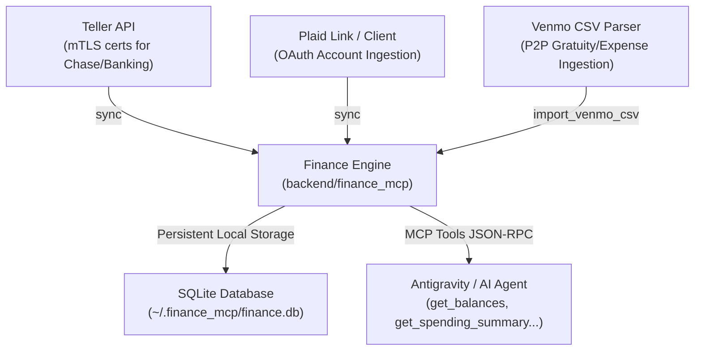

# Personal Finance MCP Server & Banking Synchronization Runbook

This skill outlines the architecture, setup, maintenance, and tool reference for the **Personal Finance Model Context Protocol (MCP) Server** located in `backend/finance_mcp/`.

---

## 1. System Architecture & Component Topology

The Personal Finance MCP server runs locally as a standard input/output (stdio) or SSE server, aggregating multiple financial data providers into a local, privacy-first SQLite database.



### Key Directory Structure:
- **Root Package:** [`backend/finance_mcp/`](file:///c:/Users/PeterTeehan/OneDrive%20-%20COS%20Tesla%20LLC/COS%20Tesla%20-%20Website/Summit-OS-Web-master/backend/finance_mcp/)
- **MCP Server Definition:** [`backend/finance_mcp/src/personal_finance_mcp/server.py`](file:///c:/Users/PeterTeehan/OneDrive%20-%20COS%20Tesla%20LLC/COS%20Tesla%20-%20Website/Summit-OS-Web-master/backend/finance_mcp/src/personal_finance_mcp/server.py)
- **Database Layer:** [`backend/finance_mcp/src/personal_finance_mcp/db.py`](file:///c:/Users/PeterTeehan/OneDrive%20-%20COS%20Tesla%20LLC/COS%20Tesla%20-%20Website/Summit-OS-Web-master/backend/finance_mcp/src/personal_finance_mcp/db.py)
- **Teller Client (mTLS):** [`backend/finance_mcp/src/personal_finance_mcp/teller.py`](file:///c:/Users/PeterTeehan/OneDrive%20-%20COS%20Tesla%20LLC/COS%20Tesla%20-%20Website/Summit-OS-Web-master/backend/finance_mcp/src/personal_finance_mcp/teller.py)
- **Plaid Client:** [`backend/finance_mcp/src/personal_finance_mcp/plaid_client.py`](file:///c:/Users/PeterTeehan/OneDrive%20-%20COS%20Tesla%20LLC/COS%20Tesla%20-%20Website/Summit-OS-Web-master/backend/finance_mcp/src/personal_finance_mcp/plaid_client.py)
- **CLI Sync & Enrollment Scripts:**
  - `backend/finance_mcp/sync_now.py`
  - `backend/finance_mcp/enroll_now.py`
  - `backend/scripts/sync_payments_from_teller.py`

---

## 2. Credentials & Security Requirements

Financial keys and mTLS certificates are stored strictly outside version control:

1. **Teller Certificates (for Chase & Primary Accounts):**
   - Stored in: `~/.finance_mcp/certs/`
   - Files: `certificate.pem`, `private_key.pem`
   - Configuration via environment:
     ```bash
     TELLER_APPLICATION_ID="your-app-id"
     TELLER_CERTIFICATE="~/.finance_mcp/certs/certificate.pem"
     TELLER_PRIVATE_KEY="~/.finance_mcp/certs/private_key.pem"
     ```

2. **Plaid Credentials (OAuth):**
   - `PLAID_CLIENT_ID`, `PLAID_SECRET`, `PLAID_ENV` (`sandbox`, `development`, `production`).

3. **Database Path:**
   - Defaults to `~/.finance_mcp/finance.db`.

---

## 3. Registered MCP Tools Reference

The server exposes the following lazy-loaded MCP tools under the `finance` server namespace:

| Tool Name | Parameters | Description |
| :--- | :--- | :--- |
| `sync` | `account_id` (optional) | Connects to Teller/Plaid APIs, pulls new balances/transactions, and upserts them to SQLite. |
| `enroll_account` | `institution_name` | Generates a browser-based enrollment or Link token to add a new bank connection. |
| `get_accounts` | None | Lists all enrolled accounts, institution names, masks (last 4 digits), and account types. |
| `get_balances` | `account_id` (optional) | Retrieves current and available ledger balances across accounts. |
| `get_transactions` | `start_date`, `end_date`, `account_id`, `category`, `limit` | Queries itemized transactions with semantic search and category filters. |
| `get_spending_summary` | `start_date`, `end_date` | Aggregates expenses by category (e.g., Supercharging, Food, Maintenance, Subscriptions). |
| `get_cash_flow` | `start_date`, `end_date` | Calculates total income vs. total expenses and net savings. |
| `get_monthly_trend` | `months` (int) | Returns month-over-month income, expense, and savings trends. |
| `import_venmo_csv` | `csv_path` | Parses Venmo transaction history statement and ingests peer-to-peer payments. |

---

## 4. Operational Workflows & CLI Runbook

### A. Manual Account Enrollment
When a bank token expires or a new account is added:
```powershell
python backend/finance_mcp/enroll_now.py
```
This launches a local web server (usually at `http://localhost:8080`) that presents the Teller Connect or Plaid Link modal to complete multi-factor authentication (MFA).

### B. Triggering a Direct Bank Sync
To pull the latest bank transactions without waiting for scheduled polling:
```powershell
python backend/finance_mcp/sync_now.py
```

### C. Teller to SummitOS Ledger Bridge
To bridge Teller transactions directly into SummitOS Azure SQL (`Rides.ManualExpenses` or `Rides.PrivatePayments`):
```powershell
python backend/scripts/sync_payments_from_teller.py
```

---

## 5. Verification & Testing Protocol

To verify server integrity after modifying tools, db schemas, or categorizers:

```powershell
# Run the complete finance MCP test suite
python -m pytest backend/finance_mcp/tests -v
```

### Key Test Coverage:
- `test_config.py`: Verifies environment variable loading and certificate existence checks.
- `test_db.py`: Tests SQLite migrations, transaction upserts, deduplication hashes, and category aggregation.
- `test_teller.py`: Mock tests for mTLS requests, token renewal, and transaction pagination.
- `test_plaid.py`: Mock tests for Plaid Link token creation and transaction syncing.
- `test_server.py`: Validates MCP JSON-RPC protocol handling and tool responses.
