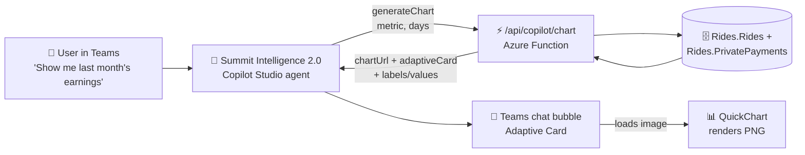

# Charts in Teams — Summit Intelligence 2.0

Copilot Studio cannot draw. It emits text and Adaptive Cards, and an Adaptive
Card can only show an image it can reach by URL. So "show me a chart" has to
become: query the real numbers, encode them into a chart-image URL, and put that
URL in a card.

`GET /api/copilot/chart` (`operationId: generateChart`) does all three in one
call — it queries `get_daily_metrics`, builds the image URL, and returns a
finished Adaptive Card the agent can post verbatim.



Note the last hop: Teams fetches the image itself, when the card renders. The
API never downloads a PNG — it only hands out a URL.

---

## What the endpoint returns

| Field | Use it for |
|---|---|
| `chartUrl` | The chart image. Drop it into an Adaptive Card `Image.url`. |
| `adaptiveCard` | A complete Adaptive Card 1.5 payload — title, subtitle, image, and headline figures. Send this as-is. |
| `summary` | One line of prose for the agent to say alongside the card. |
| `chart.labels` / `chart.values` | The plotted numbers, so follow-up questions ("what was the best day?") need no second call. |
| `chart.total` / `.average` / `.peak` | Pre-computed headline figures. |
| `chart.hasData` | `false` when the range is genuinely empty — say so rather than showing a flat chart. |

### Parameters

| Name | Values | Default |
|---|---|---|
| `metric` | `earnings` (Uber + private combined), `tips`, `trips`, `miles`, `hours` | `earnings` |
| `days` | 1–90, counting back from today in Mountain Time | `7` |
| `start_date` / `end_date` | `YYYY-MM-DD`, Mountain Time; both or neither | — |
| `chart_type` | `bar` to compare buckets, `line` for a trend | `bar` |
| `group` | `auto`, `day`, `week` | `auto` |
| `title` | Overrides the generated title | — |

`group=auto` plots days up to 31 points and rolls up to Monday-anchored weeks
beyond that — a 90-bar daily axis is unreadable, and the URL that carries it
starts straining the Adaptive Card image-URL budget.

Days with no activity are plotted as zero, not dropped. A time axis that closes
up its empty days reads as though those days never happened.

Try it before wiring anything up:

```bash
curl "https://summitos-api.azurewebsites.net/api/copilot/chart?metric=earnings&days=14"
```

Paste the `chartUrl` from the response into a browser to see the image, and the
`adaptiveCard` into <https://adaptivecards.io/designer/> to see the card.

---

## Wiring it into Copilot Studio

### Step 1 — Refresh the action from the OpenAPI spec

The agent already consumes `/api/copilot/openapi.json`, and `generateChart` is
in it. In Copilot Studio, open **Summit Intelligence 2.0 → Tools**, find the
Summit Intelligence API connector, and **refresh** it so the new operation
appears. No Power Automate flow is needed.

### Step 2 — Create the topic

**Topics → + New topic → From blank**, named `Generate Data Chart`.

Trigger phrases:

- *"Show me a chart"*
- *"Graph my earnings"*
- *"Display performance chart"*
- *"Visualize last month"*
- *"Plot my trips"*

### Step 3 — Add the nodes

1. **Question node** (only if you want to force a choice rather than let the
   agent infer one): *"What would you like to see — earnings, tips, trips,
   miles, or drive hours?"* → save as `Topic.Metric`.
2. **Call an action** → `generateChart`.
   - `metric` ➔ `Topic.Metric`
   - `days` ➔ `Topic.Days` (or leave unset for the 7-day default)
   - Output ➔ `Topic.ChartResult`
3. **Send a message** → **+ Add → Adaptive Card** → **Edit JSON**.

The API already returns a finished card, so the message node just forwards it:

```
{Topic.ChartResult.adaptiveCard}
```

If you would rather control the layout in Copilot Studio, use `chartUrl`
directly instead:

```json
{
  "$schema": "http://adaptivecards.io/schemas/adaptive-card.json",
  "type": "AdaptiveCard",
  "version": "1.5",
  "body": [
    {
      "type": "TextBlock",
      "text": "📊 Summit Intelligence 2.0 — Visual Analysis",
      "weight": "Bolder",
      "size": "Medium",
      "wrap": true
    },
    {
      "type": "Image",
      "url": "${Topic.ChartResult.chartUrl}",
      "altText": "${Topic.ChartResult.summary}",
      "size": "Stretch",
      "msTeams": { "allowExpand": true }
    }
  ]
}
```

Always fill `altText` from `summary` — a chart that is only an image is
unreadable to a screen reader, and Teams shows the alt text when the image
fails to load.

### Step 4 — Publish and test

**Publish**, then **Channels → Microsoft Teams → Turn on Teams**. In Teams, ask
the agent:

> *"Show me a bar chart of my earnings for the last two weeks"*

---

## The Power Automate route

You do not need a flow. If you want one anyway — because the chart has to be
composed from something outside this API, or your tenant routes agent actions
through Power Automate by policy — build it as a thin wrapper that calls
`/api/copilot/chart` and passes `chartUrl` straight back to Copilot Studio.

What to avoid is the flow that builds the URL itself with `concat()`:

```text
concat('https://quickchart.io/chart?c={type:"bar",data:{labels:[', ...
```

That string is pasted into a query parameter without being URL-encoded. Braces,
quotes, and spaces are not legal there — some clients tolerate it, Teams' image
fetcher often does not, and a single label containing a comma or an ampersand
breaks the whole config silently. It also hardcodes its labels and values, so
the "chart" shows the same four made-up quarters no matter what anyone asks.
`build_chart_url` in `backend/api/copilot_charts.py` percent-encodes the whole
config, which is the part that has to be right.

---

## Data egress

A QuickChart URL carries the plotted values in its query string, and Teams
fetches that URL from whatever host serves it. For the public
`quickchart.io` endpoint, that means daily aggregate figures — dates,
earnings totals, trip counts — are visible to a third party.

Only dates and daily aggregates are ever plotted. Client names, addresses, and
trip-level rows never enter a chart URL.

To keep the figures inside the tenant, run
[QuickChart's self-hosted image](https://quickchart.io/documentation/self-hosting/)
and set the app setting:

```
QUICKCHART_BASE_URL=https://<your-host>/chart
```

The endpoint reads it at import time; no code change is needed. See
`docs/security-notes.md` for the wider picture on this API's exposure — it is
anonymous-auth and reachable from Microsoft's cloud, so treat the chart endpoint
as public-readable like the rest of `/api/copilot/*`.

---

## Chart design

The rendered PNG cannot adapt to the viewer's Teams theme, so it carries its own
opaque light surface (`#fcfcfb`) and light-mode ink rather than inheriting
anything. Every chart is a single series, so there is no legend to draw and no
categorical palette to assign — the title names the measure and the y-axis
carries the numbers. The series hue is `#2a78d6`, which clears 3:1 contrast
against that surface.

The values are also returned as `chart.labels` / `chart.values` so the agent can
state the numbers in text. That is the accessible fallback: nothing in the chart
is knowable only by looking at it.

---

## Tests

```bash
cd backend && python -m pytest tests/test_copilot_charts.py -q
```

They cover the parts that fail quietly rather than loudly: zero-filled gaps,
ascending order out of newest-first rows, the weekly rollup threshold, and the
percent-encoding of the config.
